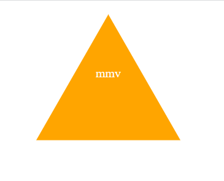

# SVG Logo Maker

  

## Description

This is a logo generator that is designed to create an svg file using shape and color based on user inputs. You have 3 shape options to choose from: circle, triangle, or square. You will then be able to select a color for the shape and the text that will be displayed on the logo.

View the deployed page at [SVG Logo Maker](n/a).

## Contents

- [Usage](#usage)
- [Screenshots](#screenshots)
- [License](#license)

## Usage

In the Terminal, navigate to the containing directory and enter "node index.js" to run the SVG Logo Maker. Upon answering all of the prompts a .svg image file is created in the "examples" directory based on your responses.

### Screenshots

## License

This application is licensed under the MIT license.

## Test

Use Jest to run .test.js files by entering "npm test" in the terminal.

## Questions

For any further questions please email @:
[madie-v@live.com](mailto:madie-v@live.com)
